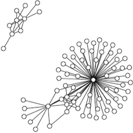

<!-- Here's how you link to a [webpage in your site](/teaching/), and -->
<!-- here's a link to an [external site](https://www.google.com) -->

## About

I'm currently a research assistant with Svetha Venkatesh's Centre for Pattern Recognition and Data Analytics at Deakin University, Australia. As part of this larger research group my role is to facilitate the overall research efforts of the Health Group into high-throughput biological data while persuing my own independent research interests.

<!-- As a very early career researcher I'm currently working on improving my independent research skills and finding areas of computational biology that hold interest to me for future research directions.  -->

Current areas of research interest, in no real order, include:

* Complex disease transcriptomics
* Alternative splicing in humans
* Methods for clustering of high-dimensional data
* Graph models for biological data
* High-dimensional data integration
* Data visualisation

When not focusing on my research I'll be found exploring and climbing in the Grampians / Gariwerd National Park. 

--- 

An overview of my publications and other research outputs can be found [here](/research/)

You can view my cv [here](https://github.com/samleenz/CV/blob/master/SamLee_CV.pdf)
